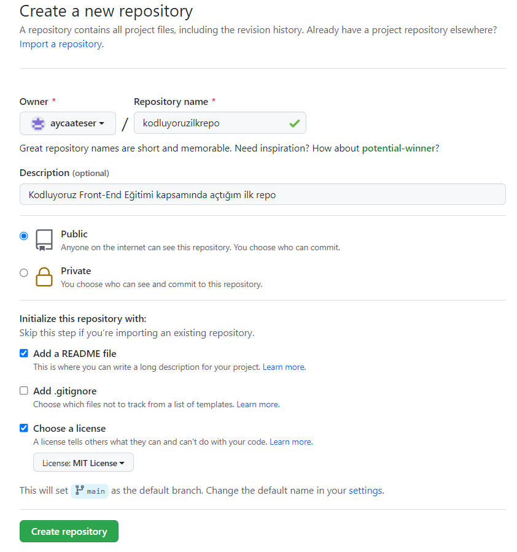

# **Kodluyoruz Ilk Repo**

Bu repo [Kodluyoruz](https://www.kodluyoruz.org/) Front-End Eğitimimizde oluşturduğumuz ilk repo.İçerisinde bir adet README dosyası,bir adet index.html barındırıyor.
<br></br>

## **Installation**

</br>

Öncelikle projeyi clonelayın.(Buraya sizin reponuzdan aldığınız link gelecek)

```
git clone https://github.com/aycaateser/kodluyoruzilkrepo.git
```

## **Usage**

</br>

Projeyi cloneladıktan sonra Visual Studio Code programında açınız.</br>
Linux için;

```
cd kodluyoruzilkrepo
code .
```

## **Contributing**

</br>

Pull requestler kabul edilir.Büyük değişiklikler için,lütfen önce neyi değiştirmek istediğinizi tartışmak için bir konu açınız.

## **License**

</br>

[MIT](https://github.com/aycaateser/kodluyoruzilkrepo/blob/main/LICENSE)
